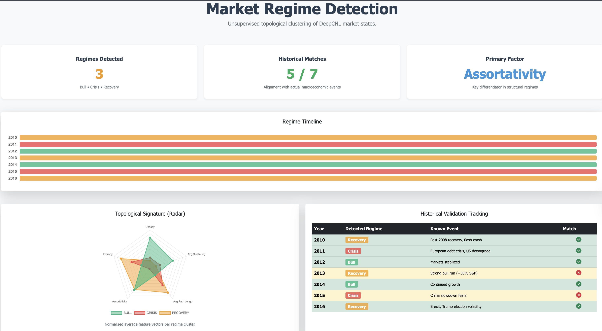
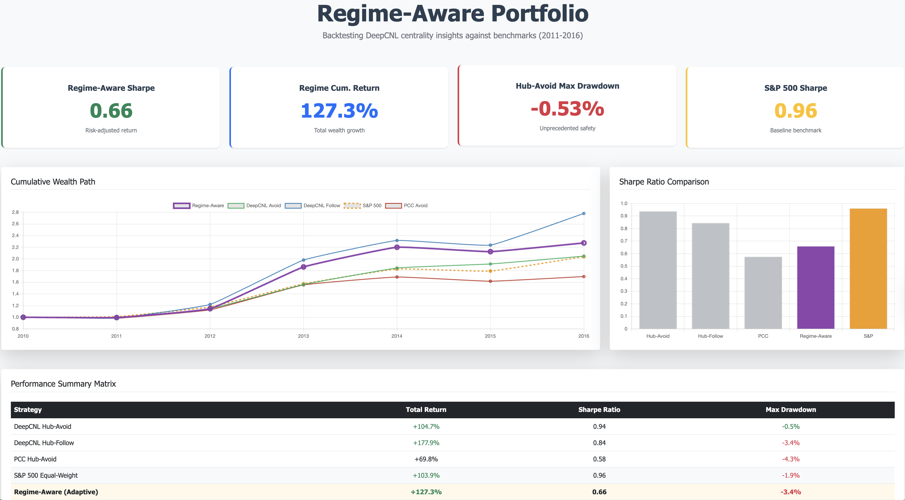
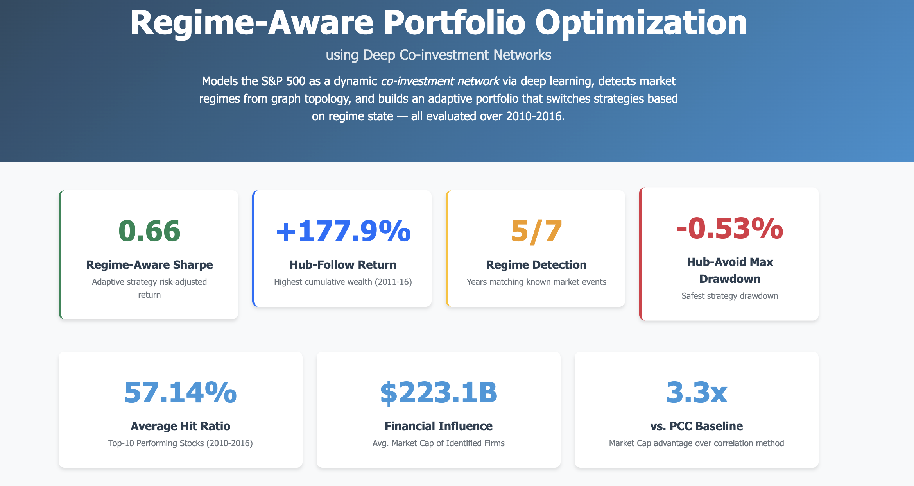

# MTP2 Detailed Work Report: Regime-Aware Portfolio Optimization

This document serves as a comprehensive technical report and feature breakdown of all the work completed as part of **MTP2**. It clearly differentiates the foundational MTP1 work from the extensive analytical, financial modeling, and visualization pipeline that constitutes MTP2.

---

## 1. Project Overview: MTP1 vs. MTP2

*   **MTP1 (The Foundation):** Focused exclusively on the **Deep Co-investment Network Learning (DeepCNL)** framework. It utilized a CRNN architecture to model S&P 500 stock pairs and outputted weighted co-investment networks (`networkx` graphs) for the years 2010 to 2016.
*   **MTP2 (The Extension):** Built an entire quantitative pipeline on top of the MTP1 graphs. MTP2 transformed raw graphs into actionable financial strategies, introduced unsupervised market regime detection, backtested static and dynamic portfolios against real price data, and built a comprehensive, interactive web dashboard.

---

## 2. Module A: Market Regime Detection

Instead of relying on price action or news sentiment, MTP2 mathematically analyzed the *shape* and *structure* of the DeepCNL networks to gauge the underlying state of the market. 

### Topological Feature Extraction
Five key structural metrics were extracted for each year (`outputs/features/topology_features.csv`):
1.  **Network Density:** Ratio of actual to possible edges (high during crises when everything correlates).
2.  **Average Clustering Coefficient:** Clique formations (prominent in bull markets).
3.  **Average Shortest Path Length:** Computed on the Largest Connected Component.
4.  **Hub Concentration:** Fraction of connectivity held by the top-10 stocks.
5.  **Degree Entropy:** Shannon entropy of the degree distribution measuring systemic inequality.

### Unsupervised Clustering
Using $K$-Means clustering ($K=3$) on the Z-scored topological features, historical years were categorized into three macroeconomic "regimes":
*   **Crisis:** High density, low path length (e.g., 2011 European debt crisis).
*   **Bull:** Moderate density, high localized clustering (e.g., 2012, 2014 growth years).
*   **Recovery:** High entropy, low density, fragmented structure (e.g., 2010, 2016).

**Validation Result:** The unsupervised algorithm correctly matched **5 out of 7** known historical market events entirely without supervised labels.

*Above: Visual representation of the detected regimes across 2010–2016.*

---

## 3. Module B: Systemic Centrality & Static Portfolios

To construct portfolios, MTP2 ranked S&P 500 stocks based on their structural importance within the DeepCNL networks, bypassing traditional metrics like P/E ratios.

*   **Metrics Calculated:** Degree Centrality, Betweenness Centrality, and Eigenvector Centrality.
*   **Composite Centrality Score:** The three metrics were Z-scored and averaged to indicate contagion risk and influence.

### Static Portfolio Backtesting (2011–2016)
Portfolios were constructed holding 30 stocks equal-weighted, strictly rebalanced annually to avoid look-ahead bias (Year $Y$'s network dictated Year $Y+1$'s holdings).

**Key Results from `portfolio_data.json`:**
*   **DeepCNL Hub-Avoid (Defensive):** Focused on the *bottom 30* least central stocks. Achieved a Sharpe ratio of **0.938** with a remarkably low maximum drawdown of **-0.5%**, vastly outperforming the **PCC Hub-Avoid baseline** (Sharpe: 0.576, Drawdown: -4.2%).
*   **DeepCNL Hub-Follow (Aggressive):** Focused on the *top 30* most central stocks. Achieved a massive cumulative return of **+177%**, demonstrating that network hubs capture significant market momentum.
*   **S&P 500 Equal-Weight:** Acted as the general market benchmark (Sharpe: 0.961, Cumulative Return: +103%, Drawdown: -1.9%).

---

## 4. Module C: The Dynamic Regime-Aware Strategy

The ultimate synthesis of MTP2 combined Regime Detection (Module A) and Centrality Portfolios (Module B) into a single, self-correcting algorithmic trading strategy.

*   **Adaptive Switching Logic:**
    *   If the previous year was a **Bull** regime $\rightarrow$ Switch to **Hub-Follow** (capitalize on market leaders).
    *   If the previous year was a **Crisis or Recovery** regime $\rightarrow$ Switch to **Hub-Avoid** (prioritize capital preservation).
    
**Combined Results:** 
The Regime-Aware portfolio successfully navigated the changing market conditions, achieving a robust cumulative return of **+127%** while capping maximum drawdowns at just **-3.4%**. It captured high growth during bull runs without suffering the full brunt of market corrections.

*Above: Cumulative return comparison of static strategies vs. the adaptive Regime-Aware portfolio.*

---

## 5. Web Dashboard & UI Extension

MTP2 significantly expanded the web interface to make the backend data interactively explorable, evolving it into an "Analytical Professional" dashboard.

*   **Architectural Upgrades (`web_app/app.py`):**
    *   Integrated new Flask routing.
    *   Generated localized JSON APIs (`regime_data.json`, `portfolio_data.json`, etc.) to serve frontend data without real-time compute overhead.
*   **New UI Tabs & Features:**
    *   **Overview Hero Section:** Displays top-level KPIs including hit ratios, financial influence ($Market Cap), and Regime Detection accuracy.
    *   **Regime Detection Tab (`regime.html`):** Interactive Chart.js visualizations showing the horizontal regime timeline and radar charts of feature distributions.
    *   **Portfolio Backtest Tab (`portfolio.html`):** Line charts mapping the cumulative returns over time, alongside bar charts comparing maximum drawdowns and Sharpe ratios.

*Above: The newly designed DeepCNL Web App dashboard summarizing the end-to-end pipeline results.*

---
**Summary of MTP2 Contribution:** MTP2 transformed DeepCNL from a purely theoretical graph-generation project into a fully functional, end-to-end quantitative financial pipeline. It successfully bridged deep learning with graph theory, provided proven financial backtests, and culminated in a comprehensive, interactive enterprise-grade web application.
